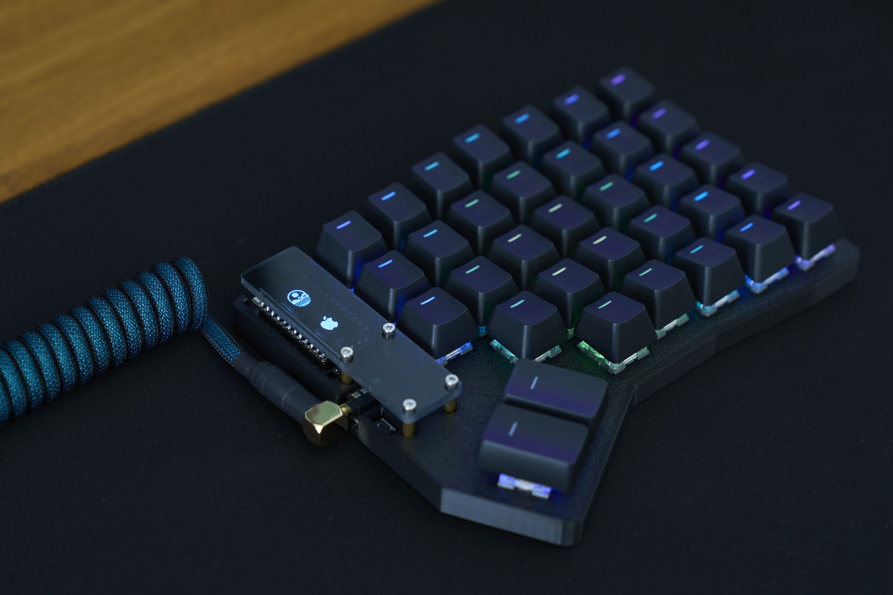
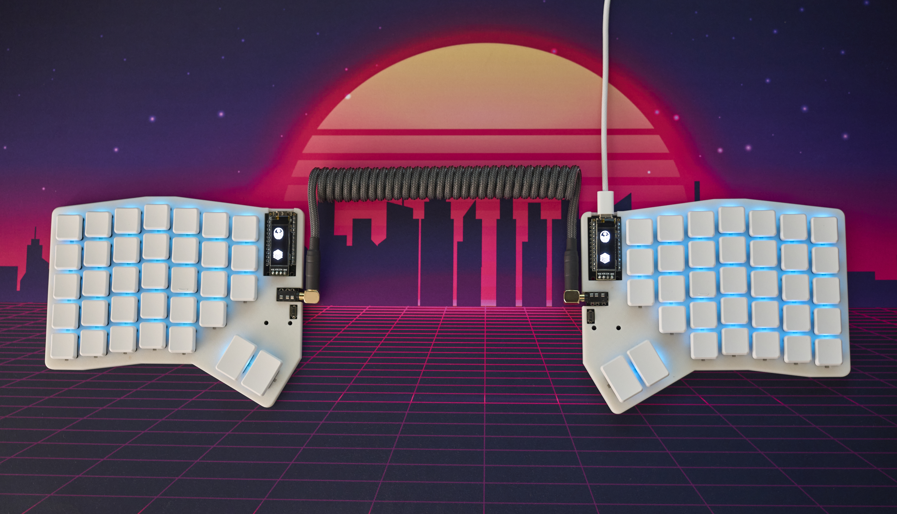
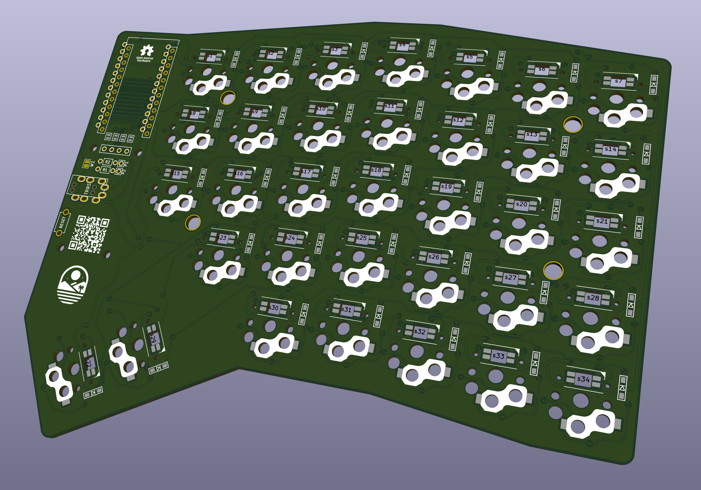
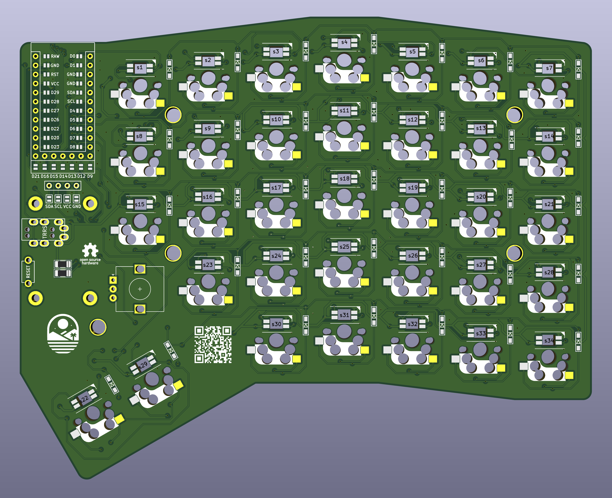

# Nomad Keyboard

The Nomad is a 7×5 keys, column-staggered split keyboard based largely on the [Sofle Choc by Brian Low](https://github.com/brianlow/SofleKeyboard).
It uses low profile Kailh Choc v1 switches with hotswap sockets and features per-key RGB lighting via SK6812 Mini-E LEDs.
Compared to the Sofle Choc the nomad offers an additional thumb cluster key, an additional modifier key in the 5th row and a 7th inner column with 3 keys each.
To make the keyboard more compact, there also (currently) is no option for a rotary encoder.

## Firmware 

Nomad uses [QMK firmware](https://github.com/fiendie/qmk_firmware/tree/nomad)

## Bill of Materials


| **Item**                                 | **Quantity** | **Notes**                                                                       |
|------------------------------------------|--------------|---------------------------------------------------------------------------------|
| **Nomad PCB**                            | 2            | Custom left and right halves.                                                   |
| **Kailh Choc v1 or MX switches**         | 68           | Choose based on version, the Choc version is only compatible with v1 switches!. |
| **Keycaps (MBK, ChocFox, or MX)**        | 68           | Must match switch type and profile preference.                                  |
| **SMD Diodes (1N4148, 0805 package)**    | 68           | One per switch; surface-mount only.                                             |
| **RP2040 Controller**                    | 2            | Tested with SplitKB Liatris and 42.Keebs Frood.                                 |
| **TRRS jacks**                           | 2            | For inter-half communication.                                                   |
| **TRRS cable**                           | 1            | Male-to-male, preferrably with 90 degree plugs                                  |
| **ALPS EC12 Low-Profile Rotary Encoder** | 2            | Optional rotary input.                                                          |
| **Tactile Reset Button**                 | 2            | Optional but useful.                                                            |
| **OLED Display (SSD1306 128x32)**        | 2 (optional) | Optional I2C displays.                                                          |
| **SMD Resistors (0805 package)**         | 4            | I2C pull-up resistors, ony needed for the displays                              |
| **Header Pins**                          | Varies       | For MCU, OLEDs.                                                                 |
| **3D-Printed Case**                      | 2 halves     | Top shell only; open-bottom design using included STL files.                    |
| **Acrylic Cover**                        | 2 halves     | Laser-cut cover layer using included DXF file.                                  |
| **M2 Standoffs (12 mm)**                 | 8            | For mounting cover to case.                                                     |
| **M2 Countersunk Screws (top)**          | 8            | For securing the acrylic cover to standoffs.                                    |
| **M2 Hex Screws (bottom of standoffs)**  | 8            | Attach standoffs from underneath the case edge.                                 |
| **Rubber feet**                          | 8+           | Optional, for grip and elevation.                                               |


## Default layout 

**Base Layer**
```
┌──────┬─────┬─────┬─────┬─────┬─────┬─────┐                ┌─────┬─────┬─────┬─────┬─────┬─────┬──────┐
│ Esc  │  1  │  2  │  3  │  4  │  5  │  <  │                │  >  │  6  │  7  │  8  │  9  │  0  │ Bksp │
├──────┼─────┼─────┼─────┼─────┼─────┼─────┤                ├─────┼─────┼─────┼─────┼─────┼─────┼──────┤
│ Tab  │  Q  │  W  │  E  │  R  │  T  │  {  │                │  }  │  Z  │  U  │  I  │  O  │  P  │  ?   │
├──────┼─────┼─────┼─────┼─────┼─────┼─────┤                ├─────┼─────┼─────┼─────┼─────┼─────┼──────┤
│  =   │  A  │  S  │  D  │  F  │  G  │  |  |                │  -  │  H  │  J  │  K  │  L  │  +  │  #   │
├──────┼─────┼─────┼─────┼─────┼─────┼─────┘                └─────┼─────┼─────┼─────┼─────┼─────┼──────┤
│ LSft │  Y  │  X  │  C  │  V  │  B  │                            │  N  │  M  │  ,  │  .  │  ↑  │ RSft │
├──────┼─────┼─────┼─────┼─────┼─────┼─────┬─────┐    ┌─────┬─────┼─────┼─────┼─────┼─────┼─────┼──────┤
| Ctrl │ L3  │ L2  │ Opt │ GUI |     | Spc | Del |    | L1  | Rtn |     │ GUI │ Opt │  ←  │  ↓  │  →   |
└──────┴─────┴─────┴─────┴─────┘     └─────┴─────┘    └─────┴─────┘     └─────┴─────┴─────┴─────┴──────┘
```


## Images







